<p align="center">
  
</p>

<h1 align="center">Extreme InfiniTV</h1>

<p align="center"><strong>A cross-platform IPTV player for Xtream Codes and M3U / M3U8 playlists.</strong></p>

<p align="center">
  Live TV with EPG and catch-up, movies, series, custom playlists, offline downloads, and TV-remote (D-pad) navigation.<br/>
  Ships on Windows (Microsoft Store + installer), Android phone / tablet / TV (Google Play), macOS, Linux, and the web.
</p>

<p align="center">
  <a href="https://apps.microsoft.com/detail/9NN162Z0WXSR">
    
  </a>
  <a href="https://play.google.com/store/apps/details?id=com.infinitel8p.xtream">
    
  </a>
  <a href="https://snapcraft.io/extreme-infinitv">
    
  </a>
  <a href="https://github.com/infinitel8p/Extreme-InfiniTV/releases/latest">
    
  </a>
</p>

<p align="center">
  <a href="https://github.com/infinitel8p/Extreme-InfiniTV/releases/latest">
    
  </a>
  <a href="https://github.com/infinitel8p/Extreme-InfiniTV/releases">
    
  </a>
  <a href="https://github.com/infinitel8p/Extreme-InfiniTV/releases">
    
    </a>
  <a href="https://github.com/infinitel8p/Extreme-InfiniTV/stargazers">
    
  </a>
  
</p>

<p align="center">
  <a href="https://dev.infinitel8p.com/Extreme-InfiniTV/">
    
  </a>
  <a href="https://discord.gg/GH5V3AkzfA">
    
  </a>
  <a href="https://github.com/infinitel8p/Extreme-InfiniTV/issues">
    
  </a>
  <a href="https://github.com/infinitel8p/Extreme-InfiniTV/discussions">
    
  </a>
</p>

## Screenshots

<p align="center">
  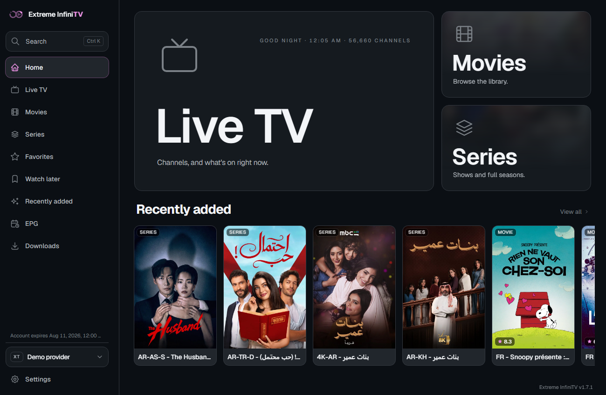
</p>

<details>
<summary>More screenshots (Live TV, EPG, Movies, Series, Android TV, mobile)</summary>

**Desktop**

| | | |
|---|---|---|
| 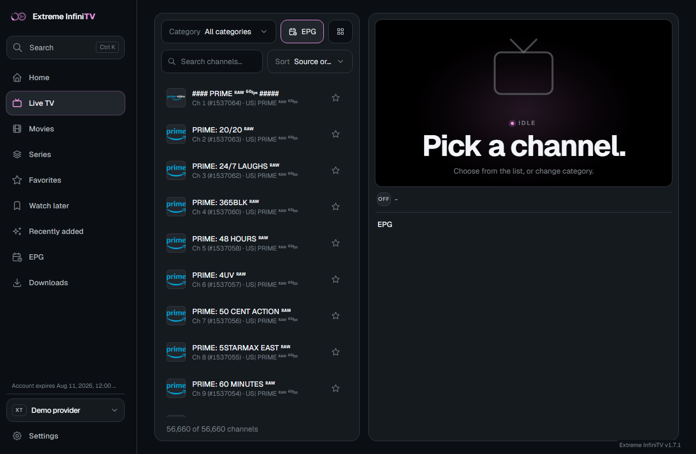 | 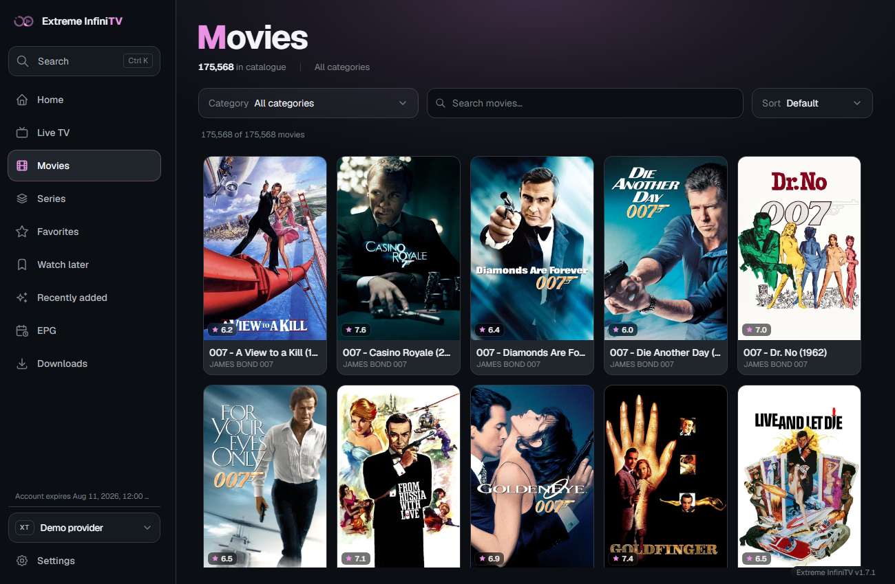 | 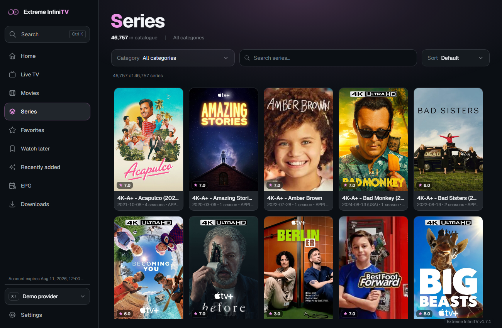 |
| 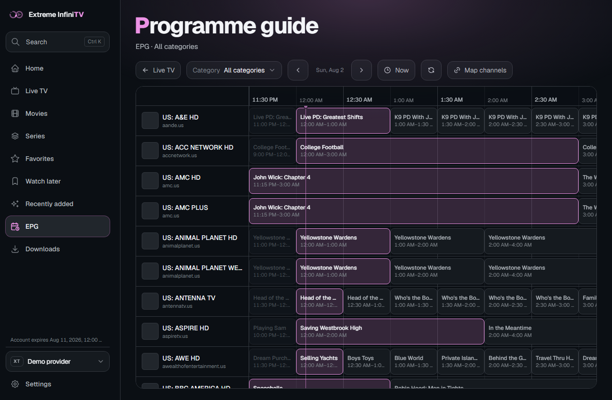 | 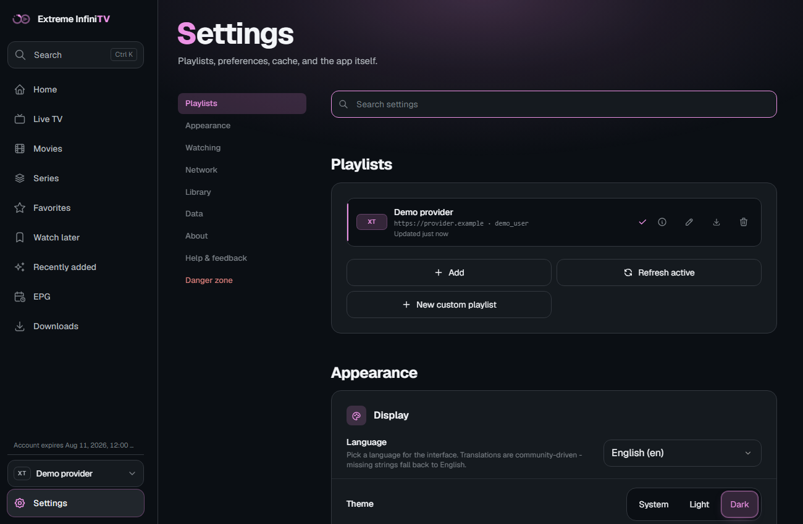 | 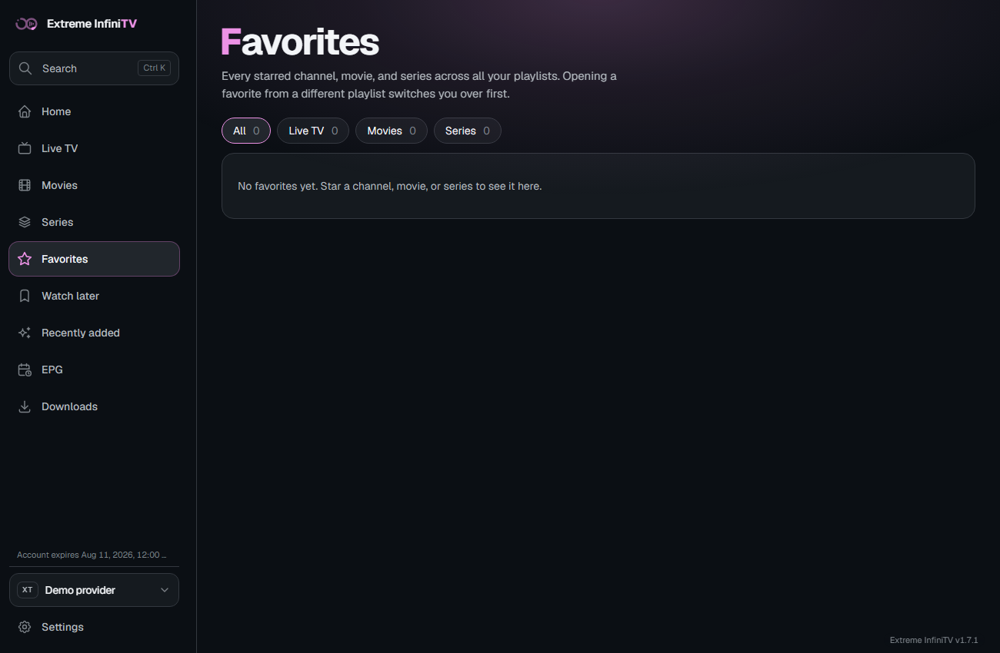 |

**Android TV (dedicated 10-foot interface, D-pad focus)**

| | | |
|---|---|---|
| 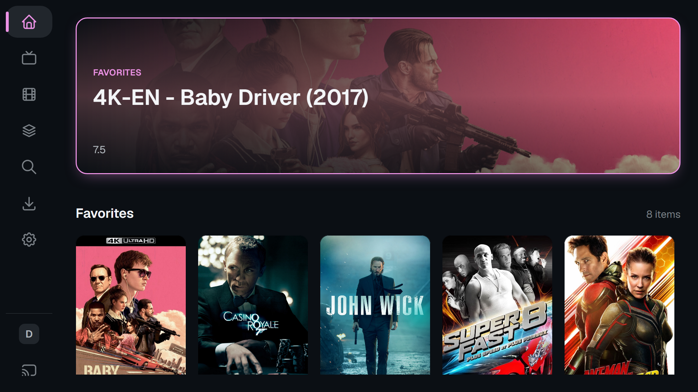 | 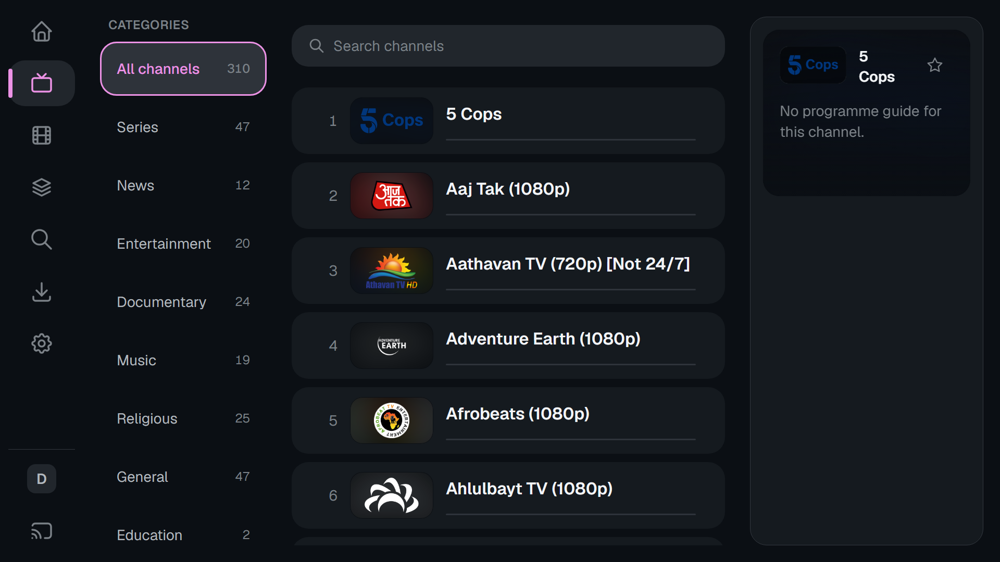 | 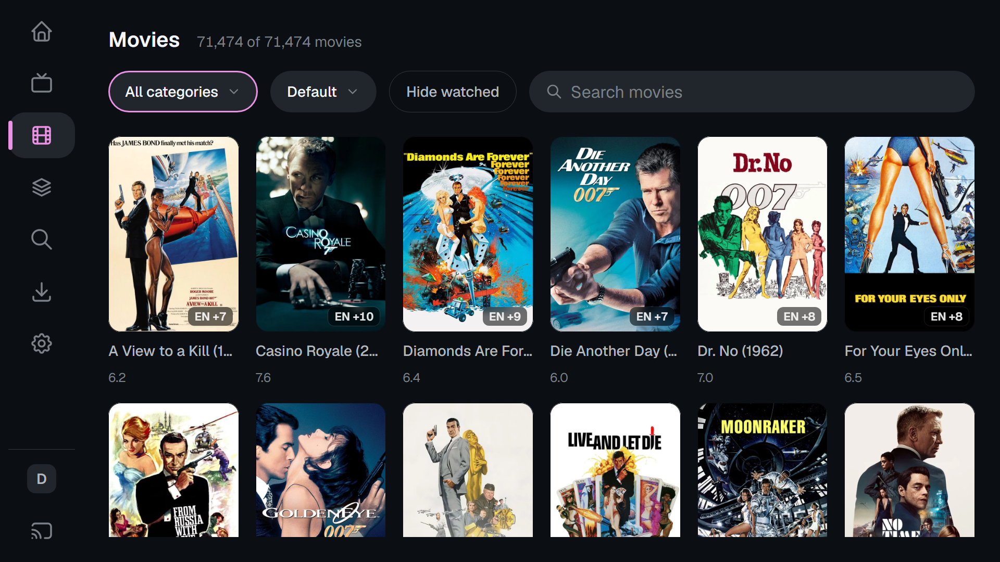 |

**Phone (portrait, touch)**

| | | |
|---|---|---|
| 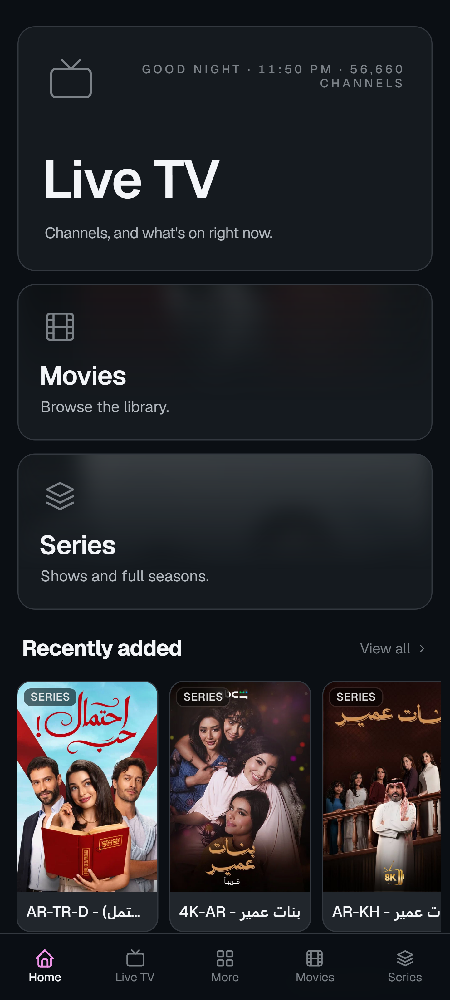 | 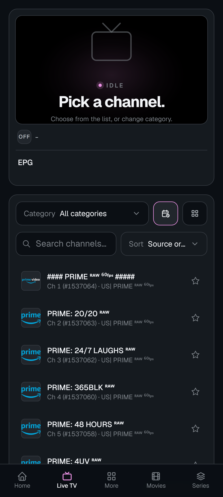 | 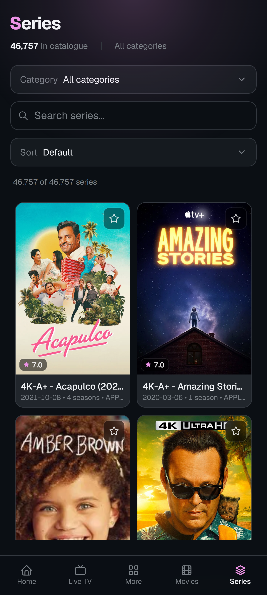 |

</details>

## Features

- **Any source, one UI.** Sign in with Xtream Codes credentials, paste an M3U / M3U8 URL or a direct stream link, or load a playlist file from your device. The app detects the mode automatically.
- **Live TV** with category filtering, channel search, channel-number entry, a virtualised list, inline EPG (now / next / today), and automatic channel-logo fallback from iptv-org's logo collection when a provider doesn't supply one.
- **[Catch-up TV and replay](https://dev.infinitel8p.com/Extreme-InfiniTV/catch-up/).** Replay programmes from your provider's archive and pause or rewind behind live, with a full-programme seekbar.
- **[Custom playlists](https://dev.infinitel8p.com/Extreme-InfiniTV/custom-playlists/)** built in a full in-app editor: pull channels from any playlist, reorder and group them, rename, renumber, find and replace, check links, and export as `.m3u`.
- **[Add a stream from any website](https://dev.infinitel8p.com/Extreme-InfiniTV/add-from-website/).** Paste a page URL and the app sniffs the network for playable HLS / DASH streams, with quality labels and multi-select.
- **Movies (VOD)** and **Series** library with poster grids, detail dialogs, season / episode navigation, mark watched / unwatched with a watched badge, an optional hide-watched filter, and a "Surprise me" random-title picker.
- **[TMDB metadata enrichment](https://www.themoviedb.org/).** Optional, bring-your-own free API key (Settings > Network): cast, director, and similar titles on movie and series detail pages.
- **"Because you watched" recommendations** on the home screen, plus similar-title suggestions on detail pages, both computed locally from category, cast, and director so they work even without a TMDB key.
- **Search** (`Ctrl+K`) across channels, movies, and series, with recent searches you can revisit or clear.
- **Full schedule grid** on the EPG page, with timezone-aware "all times local" rendering, custom EPG sources, and channel mapping.
- **A player for everything.** Three embedded engines (ArtPlayer, Video.js, Shaka) cover HLS, MPEG-TS, MPEG-DASH with ClearKey, and HEVC (with one-click install of the Windows HEVC extension). Picture-in-picture included.
- **[Embedded subtitles](https://dev.infinitel8p.com/Extreme-InfiniTV/subtitles/)** from MP4 files everywhere, plus MKV playback on desktop (remuxed on the fly through a bundled FFmpeg on macOS / Linux, and as a Windows fallback when WebView2 can't demux a file), with an option to turn captions on by default, **audio track switching**, and **[automatic audio repair](https://dev.infinitel8p.com/Extreme-InfiniTV/audio-formats/)** for AC-3 / E-AC-3 / MP2 / DTS.
- **[External players](https://dev.infinitel8p.com/Extreme-InfiniTV/external-players/).** Hand any stream to MPV or VLC on desktop (with window reuse), or to any installed video app on Android.
- **Multiple playlists**, switchable from the sidebar without re-entering credentials, each with its own favorites, watchlist, progress, and health panel.
- **TV-first navigation.** Spatial focus (D-pad / arrow keys) is wired across the whole app via `spatial-navigation-polyfill`. Hit targets, focus rings, and reflow tested for 10-foot UI, plus a TV safe-area setting for overscan and a collapsible desktop sidebar.
- **16 languages** including RTL (Arabic, Urdu), translated before first paint so there's no flash of English.
- **Light and dark themes** with seven accent colors, both first-class; each playlist can also override the accent (and add an emoji) so you can tell them apart at a glance. Honours `prefers-color-scheme`, `prefers-reduced-motion`, and `prefers-contrast`.
- **Adjustable font scale** (Small / Default / Medium / Large / X-Large) plus a responsive root size that scales the whole UI on 4K and 8K displays.
- **Self-updating desktop builds** (Windows NSIS and Linux AppImage) via the Tauri updater, signed with minisign and served from GitHub Releases, with stable and beta channels and a "What's new" dialog after each update.
- **Backup and restore.** Export playlists, preferences, and settings as one file and import them on another device.
- **Offline-friendly persistence.** Credentials and preferences live in the OS app-data dir on Tauri builds, with a localStorage / cookie fallback on the web build; clear your viewing history from Settings at any time.
- **No tracking, no ads, no telemetry.** The app collects nothing about you or your viewing habits. Outbound metadata lookups are limited to TheTVDB artwork and episode details (keyless, can be turned off in Settings) and the optional TMDB enrichment above with your own API key.

## Install

| Platform | How | Updates |
| --- | --- | --- |
| Windows (Microsoft Store) | [apps.microsoft.com](https://apps.microsoft.com/detail/9NN162Z0WXSR) | Microsoft Store |
| Windows (sideload) | NSIS `.exe` (or `.msi`) from [Releases](https://github.com/infinitel8p/Extreme-InfiniTV/releases/latest) | In-app auto-updater |
| macOS (Apple Silicon + Intel) | Universal `.dmg` from [Releases](https://github.com/infinitel8p/Extreme-InfiniTV/releases/latest) | Update check in-app, download from Releases |
| Linux (Snap, most distros) | `sudo snap install extreme-infinitv` or [Snap Store](https://snapcraft.io/extreme-infinitv) | Snap Store |
| Linux (Debian / Ubuntu / Mint) | `.deb` from [Releases](https://github.com/infinitel8p/Extreme-InfiniTV/releases/latest) | Manual |
| Linux (Fedora / openSUSE / RHEL) | `.rpm` from [Releases](https://github.com/infinitel8p/Extreme-InfiniTV/releases/latest) | Manual |
| Linux (any distro, portable) | `.AppImage` from [Releases](https://github.com/infinitel8p/Extreme-InfiniTV/releases/latest) | In-app auto-updater |
| Raspberry Pi 4 / 5 (64-bit OS) | `sudo snap install extreme-infinitv`, or arm64 `.deb` / `.AppImage` from [Releases](https://github.com/infinitel8p/Extreme-InfiniTV/releases/latest) | Snap Store / in-app (AppImage) |
| Android phone / tablet | [Google Play](https://play.google.com/store/apps/details?id=com.infinitel8p.xtream) | Play Store |
| Android TV / Fire TV | [AFTVnews Downloader](https://www.aftvnews.com/downloader/) (see below), or Play Store on supported devices | Manual / Play Store |
| Web preview | Build with `pnpm build` and serve `dist/` (no auto-update, no native features) | Manual |

### Android TV / Fire TV

Sideload with the [AFTVnews Downloader](https://www.aftvnews.com/downloader/) app. Open it, enter one of the codes below in the URL field, and install:

- **`8281651`** (or `aftv.news/8281651`) - the full app, with the TV browse UI (Home, Live TV, Movies, Series, Search, Downloads, Settings). This is what most TV users want.
- **`1317634`** (or `aftv.news/1317634`) - the receiver-only kiosk build. No browse UI; it boots straight into a pairing screen and only accepts casts from your phone or desktop.

Both codes always resolve to the current stable release, so they keep working across updates. ADB (`adb install Extreme-InfiniTV.apk`) works too if you'd rather skip Downloader.

### via winget

The Microsoft Store listing is federated through `winget`, so you can install without opening the Store:

```powershell
winget install --id 9NN162Z0WXSR --source msstore
```

### macOS: "Extreme InfiniTV.app" cannot be opened

The macOS build is not yet notarized by Apple, so Gatekeeper blocks it on first launch with a message like _"Apple could not verify Extreme InfiniTV.app is free of malware"_. After dragging the app from the `.dmg` into `/Applications`, remove the quarantine flag from a Terminal:

```bash
xattr -dr com.apple.quarantine "/Applications/Extreme InfiniTV.app"
```

Then open the app normally. You only need to do this once per install.

## Develop

Requirements: [pnpm](https://pnpm.io) (the package manager is pinned in `package.json`), Node 20+, the Rust toolchain (only for `tauri` commands), Java 21 and Android Studio for `tauri:android`. `mise.toml` pins the toolchain versions if you use [mise](https://mise.jdx.dev).

```bash
pnpm install
pnpm dev                  # Astro + Svelte at http://localhost:4321
pnpm tauri dev            # Native desktop shell (auto-spawns pnpm dev)
pnpm tauri:android        # Android dev shell
```

On Windows and Linux, `pnpm tauri dev` / `pnpm tauri build` first download and checksum-verify a trimmed FFmpeg sidecar into `src-tauri/binaries/` (run `pnpm fetch-ffmpeg` to do it manually). The first Tauri build therefore needs network access.

To test the dev server on another device on the LAN (phone, TV), set `XTREAM_HMR_HOST` to your machine's LAN IP so Vite advertises the right HMR host:

```bash
XTREAM_HMR_HOST=192.168.1.50 pnpm dev
```

Tests run with Vitest (`pnpm test`); ~55 suites in `tests/` cover the parsers, serializers, catch-up math, codec hints, custom playlists, backup, and the playback proxies. Lint with ESLint flat config (`pnpm lint` / `pnpm lint:fix`); no Prettier. TypeScript is in strict mode (`tsconfig.json` extends `astro/tsconfigs/strict`); the `@/*` alias maps to `src/*`.

## Community

- **[Discord](https://discord.gg/GH5V3AkzfA)** - chat, help, and beta feedback.
- **[GitHub Discussions](https://github.com/infinitel8p/Extreme-InfiniTV/discussions)** - questions and feature ideas.
- **[Issues](https://github.com/infinitel8p/Extreme-InfiniTV/issues)** - bug reports.

## Credits

Copyright (c) 2025 Ludovico Ferrara.

## License

Extreme InfiniTV is released under the [GNU General Public License v3.0 or later](LICENSE). You are free to use, study, share, and modify it; any distributed fork or derivative must remain under the same license and ship its source.

The Windows and Linux desktop builds bundle a trimmed [FFmpeg](https://ffmpeg.org) binary (LGPL v2.1) for the automatic audio fix. The full notice, source pointer, and build recipe are in the app under **Settings > About > Open-source licenses**.

The optional TMDB metadata enrichment uses the [TMDB](https://www.themoviedb.org) API with your own API key. This product uses the TMDB API but is not endorsed or certified by TMDB. Channel logos not supplied by your provider fall back to [iptv-org](https://github.com/iptv-org/api)'s CC0 logo collection.
